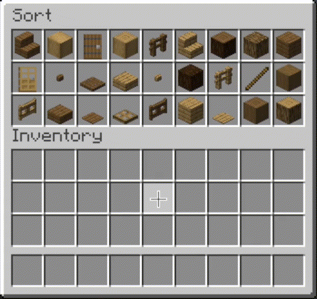
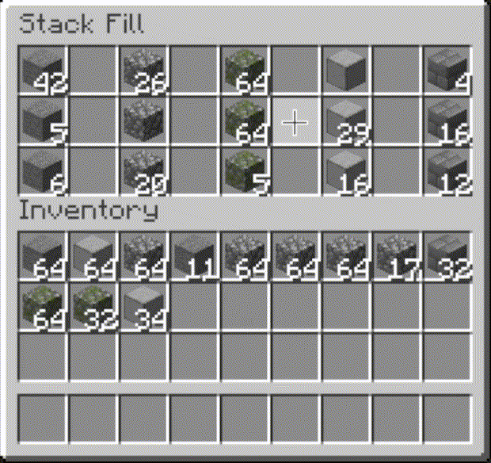
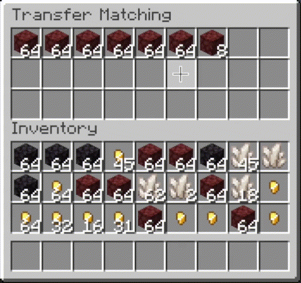
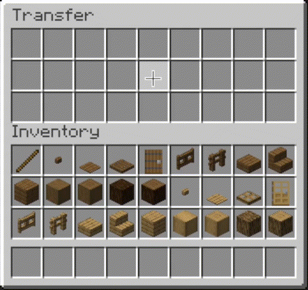
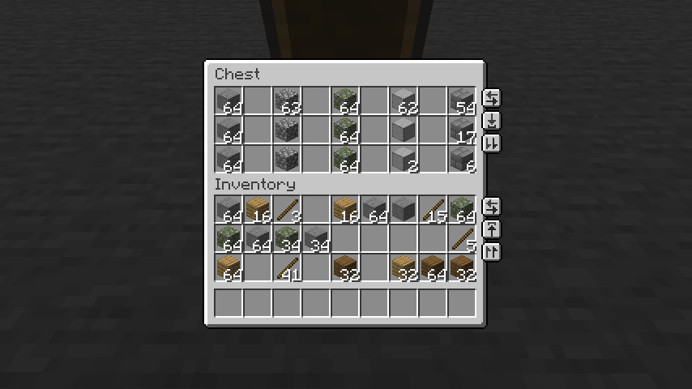
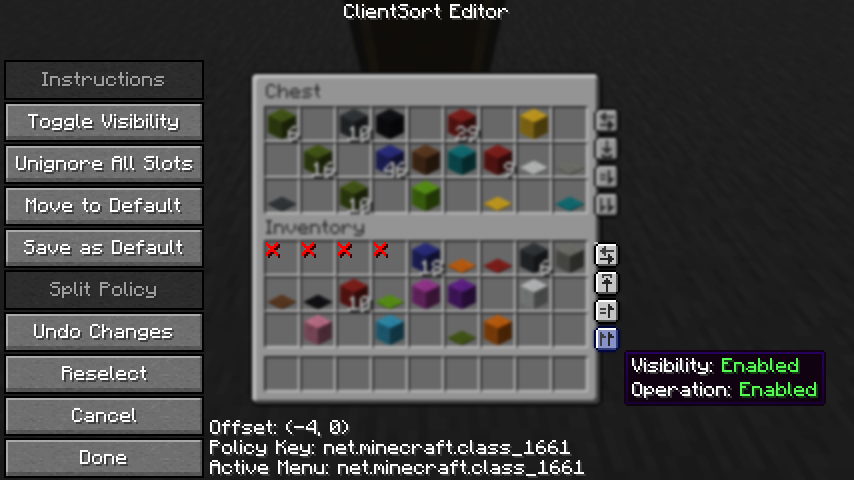

<!--suppress HtmlDeprecatedAttribute, HtmlDeprecatedTag, XmlDeprecatedElement -->

<!--suppress CheckImageSize -->

## ClientSort

Versatile and easy inventory sorting.

[![Environment](https://img.shields.io/badge/Environment-Client%20[&%20Server]-blue?logo=data:image/png;base64,iVBORw0KGgoAAAANSUhEUgAAAEAAAABACAYAAACqaXHeAAABhWlDQ1BJQ0MgcHJvZmlsZQAAKJF9kT1Iw0AYht+malUqDnYQEclQneyiIo6likWwUNoKrTqYXPoHTRqSFBdHwbXg4M9i1cHFWVcHV0EQ/AFxdnBSdJESv0sKLWI8uLuH97735e47QGhUmGp2RQFVs4xUPCZmc6ti4BU9CKCP1jGJmXoivZiB5/i6h4/vdxGe5V335xhQ8iYDfCJxlOmGRbxBPLtp6Zz3iUOsJCnE58STBl2Q+JHrsstvnIsOCzwzZGRS88QhYrHYwXIHs5KhEs8QhxVVo3wh67LCeYuzWqmx1j35C4N5bSXNdZqjiGMJCSQhQkYNZVRgIUK7RoqJFJ3HPPwjjj9JLplcZTByLKAKFZLjB/+D3701C9NTblIwBnS/2PbHOBDYBZp12/4+tu3mCeB/Bq60tr/aAOY+Sa+3tfARMLgNXFy3NXkPuNwBhp90yZAcyU9TKBSA9zP6phwwdAv0r7l9a53j9AHIUK+Wb4CDQ2CiSNnrHu/u7ezbvzWt/v0ATphymIBZ6aQAAAAGYktHRAAKAAwAGd6C8noAAAAJcEhZcwAADdcAAA3XAUIom3gAAAAHdElNRQfoBgcOHRYlcgoRAAABRklEQVR42u2YMUoDQRRAX0axUzCteIZ4hKn0FDmFhalSWKkgnkHt9AQWwhzBNr2tBGNno82ACwm6EZvxvwdTzP8s7P8zu8w8EJHIDABKKfvAFXAIbP/zmt+AR2CSc54NavFPwDDY4s+BUaorPwy4+3eBy1S3fVSOUoBv/jt2UmMv/A6cAHt1TGqsb36JzcYaMM05X3Tm56UUgLOe+SVa2wE3K2LXa+Sbb8BgRWxjjXzzDRj/EBv3fOarY6WUj8Z+glPgtlPcKbDVM998A/6cVM/GUXlN9WIQlYdUDwvzgMW/AMcp5zwDRsA9sAhQ+AK4Aw5yzs8aEZHY6AR1gjpBnaBOsLHrsE6wM9cJohPUCeoE0Qn+Hp0gOkGdoE5QRMKiE9QJ6gR1gjrBxq7DOsHOXCeITlAnqBNEJ/h7dILoBHWCOkERCcsncuextWq5TzoAAAAASUVORK5CYII=)]()
[![Latest Minecraft](https://img.shields.io/modrinth/game-versions/K0AkAin6?label=Latest%20Minecraft&color=%2300AF5C&logo=data:image/png;base64,iVBORw0KGgoAAAANSUhEUgAAAEAAAABACAYAAACqaXHeAAABhWlDQ1BJQ0MgcHJvZmlsZQAAKJF9kT1Iw0AYht+malUqDnYQEclQneyiIo6likWwUNoKrTqYXPoHTRqSFBdHwbXg4M9i1cHFWVcHV0EQ/AFxdnBSdJESv0sKLWI8uLuH97735e47QGhUmGp2RQFVs4xUPCZmc6ti4BU9CKCP1jGJmXoivZiB5/i6h4/vdxGe5V335xhQ8iYDfCJxlOmGRbxBPLtp6Zz3iUOsJCnE58STBl2Q+JHrsstvnIsOCzwzZGRS88QhYrHYwXIHs5KhEs8QhxVVo3wh67LCeYuzWqmx1j35C4N5bSXNdZqjiGMJCSQhQkYNZVRgIUK7RoqJFJ3HPPwjjj9JLplcZTByLKAKFZLjB/+D3701C9NTblIwBnS/2PbHOBDYBZp12/4+tu3mCeB/Bq60tr/aAOY+Sa+3tfARMLgNXFy3NXkPuNwBhp90yZAcyU9TKBSA9zP6phwwdAv0r7l9a53j9AHIUK+Wb4CDQ2CiSNnrHu/u7ezbvzWt/v0ATphymIBZ6aQAAAAGYktHRAAKAAwAGd6C8noAAAAJcEhZcwAADdcAAA3XAUIom3gAAAAHdElNRQfoBgcOGBJfaDpNAAAE40lEQVR42u2bbYhUVRjHf/tiaRFkWVEaZJG2YNq2mYRFf0o/RPatDYk0ssAIKi0zbfMtXKxILRJqowy3FyqjD2ZvlPEQFlLh1qpIRVLWEq7p+rK11tpuH+ZZmqZ7Z3Zm79x5aZ5vc8+9557/f87//5zznBmoxP87qgr1YjMbBpzpHzsl9ZY9AQ56JjAbmAqM8KYeYCvQCrweJxlVMQGvAhqBVcD5GW7fAywGNkrqL3kCzKwBWAtcleWjnwPzJX1WkgSY2TnAMuB2oCbHbvqBN4EHJP1YEgSY2QjgHqAJOCWibn8HngZWSuouWgLM7AbgKWBsniZWB/AQ8FJU/lAVEfDLXOdXxmTeX7g/fFpQApJ0fgdQHXMKj8QfqnIEfhJwd8Q6H6o/NEs6mlcCPJ/fCDwOnFdkq9oO4BHgeUl9kRNgZpNd51OLfHn/pfvD1kgIMLPRwNIC6Xyo/rBQ0g85E2Bmc4HVwMklutn7DbhfUkvYDdVpwA/3fF5D6UYNMNax5CyBc4Fm4JZCbp9ziM3AvZL2RGWCU9wEryhy4NvdBD/JyQTNrAa4E2iRdDylrRqY5TNidBGmwSZfJveljLsWmAs8K+mvTB5wFrAO2GVmM5IbJPVJ2gCMAxYB3UUAvAd4DKiTtCEA/DSfFev4pwKVdgZMBL5OuvSeO+nuEH9YBdxcAH/oB14FFkv6KWBsdZ7Brku6PElSeyYCLgHaUi4fB9YDD0vaX8ybITMbCTwIzAdOSGmul/RVLgQMRJdPt7WS/izAdvjnJJ33B+h8DrASOCPk+f8QkO3KbiTwKLDDzBpTGyW9DVwEzAOORLygWQGMk9QaAH6af2ktacAPOgukmwGpscWn4o6Afs4GlhNNSWyBpL0B7xgPPAHMGGR/Q5ZAUAz4wxJJnQH91bs/XJ0l+G1O7raAPk8DFoboPHYCUv3hSUl/hPjDWuCCDP3sBZaE6HwYcFsGnWdFQJS7uwF/aE/jD3XuD4cDnu92nY9Po/Ptueg8nx6QyR/uS827/o7TfYt9l38Jr3hpa1+IzlcD10cwprxKIMwfWoBlkg4EvGuCz46dISSt8CVsbUTjiZ2AgTjk8gj0hxCdNwOjIh5HXj0gXZyabv0Qks9HxTGwWuKNC4E3zOxDYKakg0lp7TVgetw7qULV+KYDY5I+jykE+EISUDRRIaBCQIWACgEVAioE/DuOlTHeY4Mh4JcyJqAjIwGSDgNHyxD8kaAfUIR5wAdlSMD72ZhgM9BbRuB7HNPgCPA985wyIaHXd57tWaVBSS8DU4D2EgbfDlwuaVNO6wBJbUADibLU/hIC3kXi8HZyagUoNTIWRPyI/Dkz20j4mVuxRNozzJwISCKiC1hkZutJ1OUbiwz8RyQOUnZm81DWJTFJ3wI3mdm1wBpgYoGBf0Pi+P6dWPcCkrYA9cCtQGcBgB8kccgyIVfwOc2AFBL6gFYz2+SmMw84MYa09iLQJOnXoXYWSVVY0iH3hxd8wdGYR53Pk7Qrqg4jLYtL+s794Rr3h0kRdb2bxBH5uyVRD5D0MXCp+8O+IXR1wGV1cT7ARz4DQvzhLWCBryGGZ6HzZ4ClvjvNW+T9ZMj/47M8af0wK8Mjm13n38eRSmI7GvOfuMx2ItYE3NJG4jjd4sylsdcEHWCDG1uyyTXEDb4SlYC/AW0t3IQpiA17AAAAAElFTkSuQmCC)](https://modrinth.com/project/K0AkAin6/versions)

[![Available for Forge](https://img.shields.io/badge/Available%20for-Forge%201.20.1-1d2d41?logo=data:image/png;base64,iVBORw0KGgoAAAANSUhEUgAAACAAAAAgCAMAAABEpIrGAAAABGdBTUEAALGPC/xhBQAAACBjSFJNAAB6JgAAgIQAAPoAAACA6AAAdTAAAOpgAAA6mAAAF3CculE8AAABvFBMVEUdLUEcLEEcLEAbK0AaKj4lNUguPVAuPU8vPVAnNkkoN0o5R1g3RVc0QlQ5R1lPXGuCi5ba3ODY2t7W2d3U19vS1trR1NjQ09jQ09fP09fP0tfS1dnT1tqBipUbKz8bLEA4Rlivtbzk5uji5Ofi5OadpK3d4OOxt77////8/Pz09fbq7O7h4+bX2t3N0dXDyM27wMa0ucChqLB9hpJkb3xDUGE7SVqyt775+fq/w8nw8fLKzdL+/v7v8PKqsLhaZnQpOUsZKj6HkJrs7u/4+fno6evX2d1hbHohMUVXY3LFyc77/Pz5+vr9/f5HVGQaKj8tO052gIy9wcfa3eDo6uz19vb29/hmcX4ZKT4jMkYwP1E9S1xZZXTO0dYqOUwXJzxoc4C5vsQgMERqdIIxQFIZKT01Q1VncX+pr7dQXWz7+/zb3uHz9PXb3eD3+PjV2NtVYXA6SFrV2Nz6+vqfpq+8wcfP0taTm6Tx8vM2RVZYZHP3+Pnn6Ot8hZGwtr2Kkp1yfIlweoeEjZivtLuAiZT19vdTX25HVGW6vsXBxcqrsblFUmMkM0chMESco6zBxsu4vcNEUWIeLkIiMkV8HzjGAAAAAWJLR0QovbC1sgAAAAd0SU1FB+AJFRIdHqqGUp8AAAE3SURBVBgZ7cGxS1RxAMDx7/d3j3fvhEDhdDFeBIJQECgGxtHgENVQS0O74Oq/4B/Q1tLWFI2hRksctDQaQbjJDR04mC/KGg6i3svf455df4N+PlyoyQTlfyVIkFplBBWN4AgSMiVyEpYtR1MOSa4YQXUyo+IE/AASVvxRAdPqV2rdYlZ9f3swBCEvVj2E7pfcUUEt135ZEgmE8r4OWPg+c0DtuPfzHWMJUJLqNT8uS+2G7tJIiHbCgynLtukvTrV9wRlpBOfXPB4At3zOmUCj/CMtor2wEWgE/rmb7Qy6wO8kWachjfzqp16ufaZv2r/jqyG1hLHWI48W9TXdouPD7W/rLz8TJYzZkY4+Nnp2adNDai3GLvfaS1mWbc0V+9eP7q2k6f4JkTSeypu3VcWp8CSl2uQ8+QuWsUtIT20mIQAAACV0RVh0ZGF0ZTpjcmVhdGUAMjAxNi0wOS0yMVQxODoyOTozMCswMjowMOts9rwAAAAldEVYdGRhdGU6bW9kaWZ5ADIwMTYtMDktMjFUMTg6Mjk6MzArMDI6MDCaMU4AAAAAGXRFWHRTb2Z0d2FyZQBBZG9iZSBJbWFnZVJlYWR5ccllPAAAAFd6VFh0UmF3IHByb2ZpbGUgdHlwZSBpcHRjAAB4nOPyDAhxVigoyk/LzEnlUgADIwsuYwsTIxNLkxQDEyBEgDTDZAMjs1Qgy9jUyMTMxBzEB8uASKBKLgDqFxF08kI1lQAAAABJRU5ErkJggg==)](https://files.minecraftforge.net)
[![Available for NeoForge](https://img.shields.io/badge/Available%20for-NeoForge%201.21%2B-f16436?logo=data:image/png;base64,iVBORw0KGgoAAAANSUhEUgAAACAAAAAgCAMAAABEpIrGAAABhGlDQ1BJQ0MgcHJvZmlsZQAAKJF9kT1Iw0AcxV/TiqIVBwuKOASsTnZREcdSxSJYKG2FVh1MLv2CJg1Jiouj4Fpw8GOx6uDirKuDqyAIfoC4ujgpukiJ/0sKLWI8OO7Hu3uPu3eA0Kgw1QxEAVWzjFQ8JmZzq2L3K/oQQgBjGJKYqSfSixl4jq97+Ph6F+FZ3uf+HP1K3mSATySOMt2wiDeIZzctnfM+cYiVJIX4nHjSoAsSP3JddvmNc9FhgWeGjExqnjhELBY7WO5gVjJU4hnisKJqlC9kXVY4b3FWKzXWuid/YTCvraS5TnMUcSwhgSREyKihjAosRGjVSDGRov2Yh3/E8SfJJZOrDEaOBVShQnL84H/wu1uzMD3lJgVjQNeLbX+MA927QLNu29/Htt08AfzPwJXW9lcbwNwn6fW2Fj4CBraBi+u2Ju8BlzvA8JMuGZIj+WkKhQLwfkbflAMGb4HeNbe31j5OH4AMdbV8AxwcAhNFyl73eHdPZ2//nmn19wOjxHK68ogHXgAAAAlwSFlzAAALEwAACxMBAJqcGAAAAAd0SU1FB+cLFAQpNXrCg1cAAAHsUExURQAAAIuOlHV1gIuOlH6AiYuOlJ6jpxMVGh4hKSYqM2ZTTXFcVXV1gHlSSHtjXIGDjIJtZ4OFjYSGjoVqYoWHj4aIj4dudYeEhYqNlIuOlIyPlo1xaI15c42Jho2QlpCUmZOWnJSSj5SXnJWZnpaboJdPPZeboJidoZqfo5taQpyhpZ5VJp9XLJ+kqKBZMaClqaFTO6KMh6Koq6OprKRON6WqrqWrrqZoW6ZxaaatsKeKiKetsKitsaiusamfn6mjpKqUjaqws6tTNqyzsqyztq6pp6+2uLGalrKjobK5u7NZNbS8vbW7u7W9vrW9v7afnbaoora+v7a/wLeBjLehnbeqqLi/v7jAwbjCwrldNbnBw7vExb1mK73Fx73Gxr3Hx76Zjr9hNL+Ecr+7ub/HxsBjM8DIysDKysF3a8GJd8GcksHLy8LMzMOHi8PLysPNzcPOzcTOzsVmM8XPz8bR0MejucfR0cjT08nU08qwrMtrMsttLcvU1cvV1cy/uszAu83X2M5tMc90Nc/a2c/a2tFwMNKgjNNxMNRyMNR5NtSMatS6t9TMytXg39d0L9nCu9nl5NuWd9zY2N3Iw96+tt+wnuCCNODNzeKHNeLu7eaMN+by8efZ0+ja2Ozg3O/o5/Dn5PXu7Pn09P///+RBO4EAAAAHdFJOUwAQQEBwgJ+al5Z5AAAAAWJLR0Sjx9rvGgAAAkNJREFUGBkFwT9vG3UAANB3dz/7bNfnxO61UkAhiSBCFGWhHcqGxMrKxtfgMyCVL8HYHRbKyNCJobJYIEoqkWIwSWPHzdkX3x/ei0QxAAAAmjaIHwIAAGBeh070hN0+YFkAAD/HId/7gmEMuK0BgDezIB3OXh12M+Y/8uXe6u+XfP4e1vNsshGEuFrM0pazf/lncn11xVUf5eIuaiRZ3bSHqtvbH16Pq+bowXBxHnZOf/+UsDPwpozF404dehcXUed4pLy6Ko2OO9HFBaqyFfT2/5vlyUvj429+evH62tKTr/z50tcsiq2gLiqVxGa5bZN7I1XSbpebBNJtJMnCoLApmnxWHizDx/nuOJr4tfgkf0iazcoA4GC0eTDZT5XDZHN0A8pVIwB46t1ePog1w8vZI1NYFZUAOPYRCTC6xwYgAHr6ALroaYAAkvZE3m7LknekaSc6MY1qCFWFJl7T/JX2GliWh8laL6oTdRWvC7T16anVs+c2BZ4/Wzk9zYY7Q7frgHJVt481d21jVUqzpr1r9vwRda4RsCrWVa66aVvLa+OsbW92cy9CH5Ju+mGxTToXZx8k+dNBOp4Mw8H7+80vZ22ImFcBxObq8Bkp3L+vnsuAAGDK49G3C7vf3/wGgBgAAAAgADJTHo2+a8TWUzKAoCnLy1GXwNtJUQmDtwHc3fSGRMPeyfnlUQ7KO9BNweV5fjTdBAwmXSAAAehOBggYdvpAkgBAf5wiiuPdukliAAA0dZwsmkg8AAAAQNEAAAAA+B8LzexYIpdh2QAAAABJRU5ErkJggg==)](https://neoforged.net)

### About

#### Sorting

To sort an inventory, simply hover over it with your mouse and press the keybind (default: middle
mouse button).

By default, items are sorted by their position in the creative inventory search tab. Alternative
sort orders can be used by holding down a modifier key while pressing the sort keybind.

- `Shift` - descending order of quantity.
- `Control` - alphabetical order.
- `Alt` - ascending order of item ID.

#### Other Operations (v2)

In addition to sorting, ClientSort `v2.0.0` and later versions include the following operations:

- **Fill Stacks**
  - Complete all partial stacks in the other inventory using items in the target inventory.
- **Transfer Matching**
  - Move all items from the target inventory to the other inventory, without adding any new item
    types to the other inventory (restock).
- **Transfer**
  - Move all items from the target inventory to the other inventory.

<table style="width:100%;">
  <tr>
    <td style="width:25%;"></td>
    <td style="width:25%;"></td>
    <td style="width:25%;"></td>
    <td style="width:25%;"></td>
  </tr>
</table>

#### Trigger Buttons (v2)

In addition to keybinds, ClientSort supports displaying small buttons above the inventory screen,
which can be used to trigger operations.

- All buttons are disabled by default, but can be enabled via the config menu or the editor screen.
- The editor screen can be opened via a keybind (unbound by default) when viewing an inventory.
- When a button is visible, you can right-click on it to open the editor screen.
- You can hover over `Instructions` for more info about configuring the trigger buttons.
- Item-transfer buttons are only shown when they are enabled on *both* inventories, so you can
  easily disable one everywhere by disabling it on the player inventory.

<table style="width:100%;">
  <tr>
    <td style="width:50%;"></td>
    <td style="width:50%;"></td>
  </tr>
</table>

#### Slot Ignoring (v2)

If you want operations to ignore specific slots, you can click on a slot while viewing the editor
screen to add it to the ignore-list for that type of inventory.

This may be particularly useful for modded inventories with special attachment slots, if ClientSort
does not recognize that they are not part of the main inventory.

#### Client-side Policies (v2)

ClientSort uses a policy system to determine when to allow operations, when to show the trigger
buttons, and when to ignore slots. The policy can be configured either via the editor screen or via
the `Policies` tab of the mod options.

Read the in-game instructions for more information on editing policies.

#### Server-side Policies (v2)

If installed on a server or in singleplayer, ClientSort uses policies to automatically disable
server-accelerated operations when it detects an incorrect state (such as item duplication).

Automatic validation can be disabled by setting the `validateOperationResults` config value to
`false` in the `clientsort-server.json` config file.

The policy list is stored in the `clientsort-server.json` config file, which can be manually edited
and reloaded using the `/clientsort reload` command.

Serverside policies are *not* synced to clients, so if a client attempts to perform a
server-accelerated operation that the server does not allow, a warning message will be shown to the
client. The player can then opt to add a client-side policy to disable the operation entirely,
disable server acceleration, or enable automatically falling back to client operations.

### Installation

#### Client Required, Server Optional

As the name suggests, ClientSort is fully functional when it is only installed on the client.
However, if it is also installed on a server, connected clients with the mod will be able to use
server-accelerated (near-instant) operations instead of the normal rate-limited operations.

#### Dependencies

Fabric: [Fabric API](https://modrinth.com/project/P7dR8mSH), [ModMenu](https://modrinth.com/project/mOgUt4GM), [Cloth Config API](https://modrinth.com/project/9s6osm5g)

Neo/Forge: [Cloth Config API](https://modrinth.com/project/9s6osm5g)

### Credits

ClientSort uses code from the following mods, in both modified and unmodified form, in accordance
with their respective licenses.

- [Mouse Wheelie](https://github.com/Siphalor/mouse-wheelie)
  by [Siphalor](https://github.com/Siphalor) ([Apache-2.0](https://github.com/Siphalor/mouse-wheelie/blob/1.20.2/LICENSE)
  license)
  - Item comparison
  - Client and server-side sorting
  - Client-side interaction manager

- [Inventory Management](https://github.com/Roundaround/mc-fabric-inventory-management) by
  [Roundaround](https://github.com/Roundaround) ([MIT](https://github.com/Roundaround/mc-fabric-inventory-management/blob/1.21/LICENSE)
  license)
  - Inventory control buttons
  - Button generation
  - Button position editor

### Related Mods

- [Mouse Tweaks](https://modrinth.com/project/aC3cM3Vq) - item scrolling, mouse dragging.
- [More Mouse Tweaks](https://modrinth.com/project/S8drsznD) - single-click crafting and trading,
  quick-move and quick-drop.
- [Tweakeroo](https://modrinth.com/project/t5wuYk45) - hand restock, auto tool-switch, tool break
  prevention and more.

### Contact

